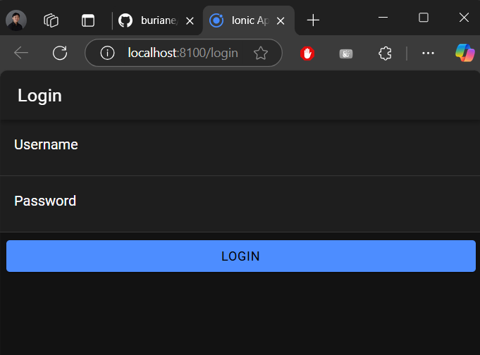
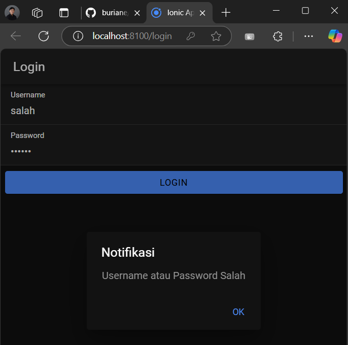
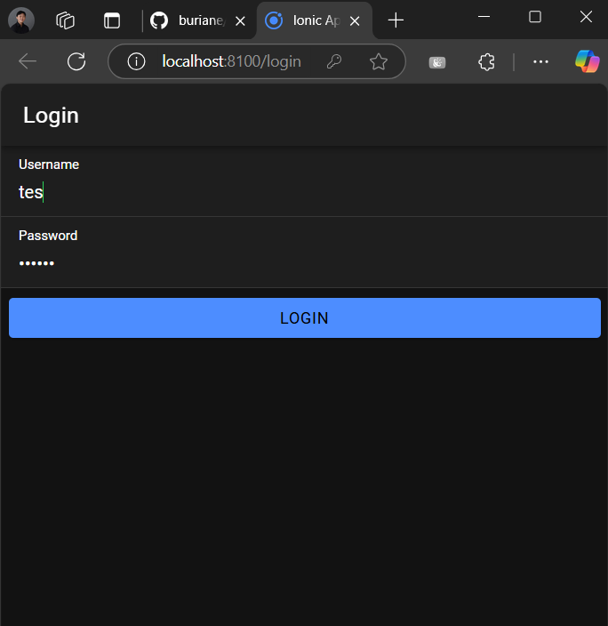
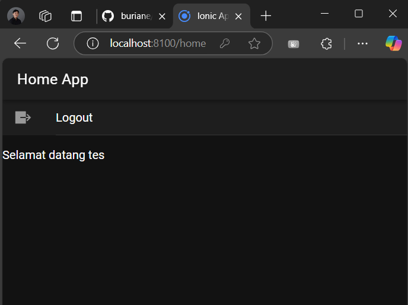

# Cara Kerja Login

Nama: Brian Cahya Purnama

NIM: H1D022009

Shift Lama: C

Shift Baru: D

## 1. Proses Login di Database
- Ketika user ingin masuk ke dalam aplikasi, tentu harus login terlebih dahulu. Caranya dengan memasukkan username dan password pada form login yang sudah disediakan
- Sistem kemudian akan melakukan pengecekan ke database apakah username dan password yang dimasukkan benar atau tidak
- Password di database sudah diamankan menggunakan MD5 untuk keamanan data
- Setelah melakukan pengecekan, jika username dan password benar maka user berhasil masuk ke dalam aplikasi. Namun jika salah maka user tidak bisa masuk dan harus mengulangi proses login

## 2. Alur Login di PHP (Backend)
Untuk menghubungkan aplikasi dengan database, dibutuhkan file koneksi.php yang berfungsi mengatur koneksi ke database MySQL. File ini juga mengatur izin akses API menggunakan CORS (Cross-Origin Resource Sharing) supaya bisa diakses dari aplikasi Ionic.

Sedangkan file login.php bertugas memproses data login dari user. File ini akan menerima username dan password yang dikirim dari aplikasi Ionic. Password yang diterima akan diubah ke format MD5 agar sesuai dengan yang ada di database. Lalu dilakukan pengecekan ke database menggunakan query SELECT untuk memastikan data user valid. Bila data ditemukan, sistem akan membuat token yang berisi gabungan waktu dan password, kemudian mengirimkan response berupa username, token dan status login berhasil. Namun jika data tidak ditemukan, sistem hanya akan mengirimkan response bahwa status login gagal.

## 3. Alur Login di Ionic (Frontend)
- Di Service (authentication.service.ts):
File authentication.service.ts memiliki peran untuk mengatur proses login ke API PHP. Di dalamnya terdapat fungsi penyimpanan token dan username yang menggunakan penyimpanan lokal Preferences. File ini juga mengatur status login user dan menangani berbagai pesan error yang mungkin muncul.
- Di Guard:
Pada bagian Guard terdapat dua file utama. File auth.guard.ts berperan sebagai security yang akan selalu mengecek apakah user sudah login atau belum. Ketika belum login maka user akan diarahkan ke halaman login, tapi jika sudah login maka user diizinkan mengakses halaman home. Sedangkan file auto-login.guard.ts bekerja saat pertama kali membuka aplikasi dengan mengecek status login. Jika ternyata user sudah login sebelumnya maka langsung diarahkan ke halaman home, kalau belum akan tetap di halaman login.
- Di Halaman Login (login.page.ts):
Untuk proses di halaman login sendiri, ada beberapa tahapan yang terjadi. Saat user menekan tombol login, sistem mengecek dulu apakah username dan password sudah diisi. Kalau masih kosong akan muncul pesan error, tapi kalau sudah diisi datanya akan dikirim ke API PHP. Setelah mendapat balasan dari API, jika login berhasil maka token dan username akan disimpan, form login dikosongkan, dan user diarahkan ke halaman home. Namun jika login gagal akan muncul pesan "Username atau Password Salah". Khusus untuk masalah koneksi internet atau local servernya belum dirun akan muncul pesan "Login Gagal Periksa Koneksi Internet".
- Di Halaman Home (home.page.ts):
Di halaman home akan tampil nama user yang sedang login. Ada juga tombol logout yang bisa digunakan untuk keluar dari aplikasi. Ketika tombol ini ditekan, sistem akan menghapus token dan username dari penyimpanan, mengubah status login menjadi false, dan mengembalikan user ke halaman login.

## 4. Penyimpanan Data Login
a. Data yang disimpan:
- Token (dengan key 'auth-login')
- Username (dengan key 'auth-user')
b. Cara penyimpanan:
- Menggunakan Capacitor Preferences (penyimpanan lokal)
- Data tersimpan sampai user logout
- Saat aplikasi dibuka ulang, data masih ada
c. Penghapusan data:
- Data dihapus saat user logout
- Menggunakan fungsi clearData() di service

## 5. Keamanan
- Password di database dalam bentuk MD5
- Menggunakan token untuk validasi user
- Routes dilindungi dengan Guard
- API dilindungi dengan CORS
- Form login ada validasi input (Jika salah satu atau kedua field masih kosong, sistem akan menampilkan pesan error "Username atau Password Tidak Boleh Kosong".)

## Screenshot Aplikasi

